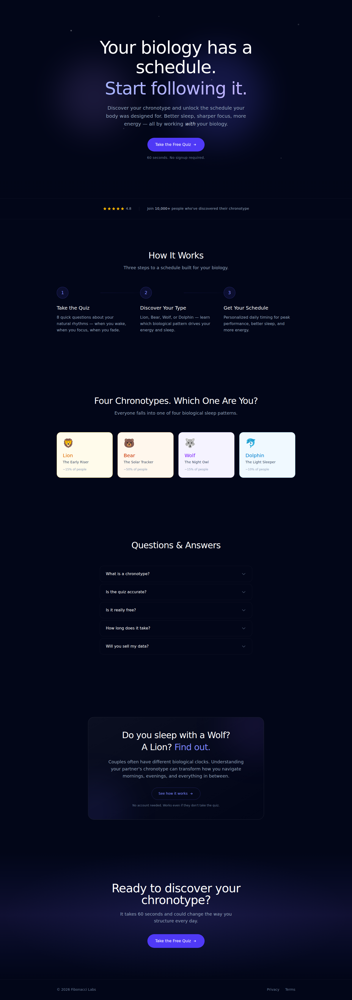
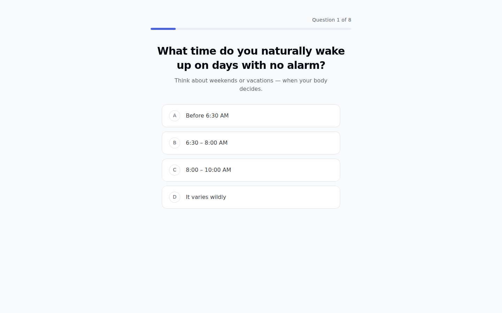
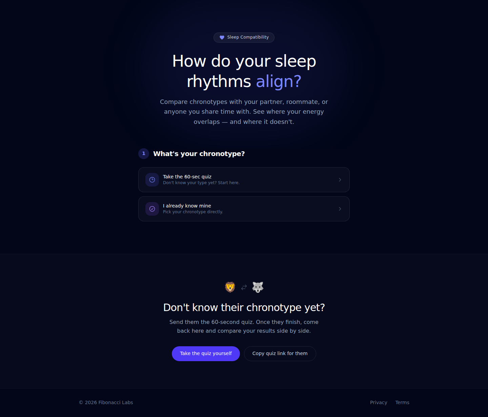
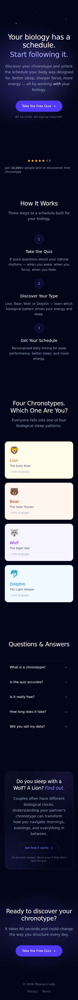
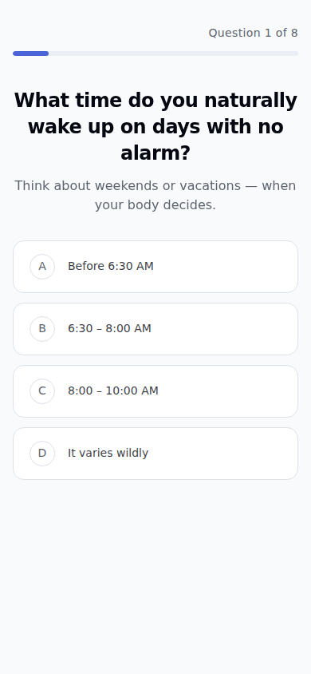
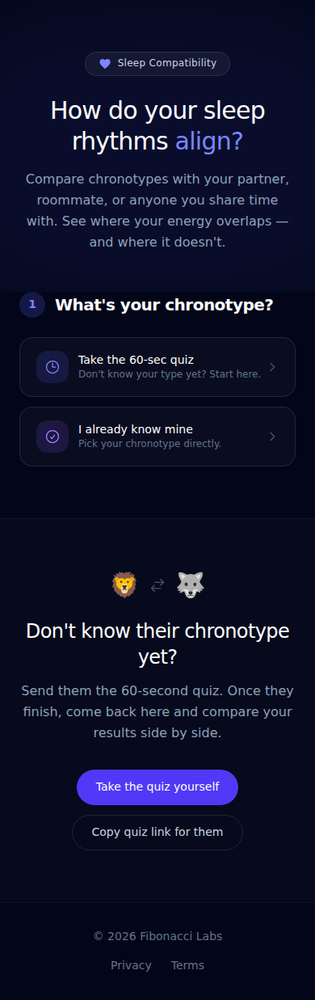

# SleepPath

> Your biology has a schedule. Start following it.

SleepPath is a circadian rhythm and chronotype app that helps users discover their chronotype (Lion, Bear, Wolf, or Dolphin) and get a personalized daily schedule that adapts to their real sleep data.

## Repository Structure

```
sleep/
├── package.json             # Root orchestration (concurrently)
├── api/                     # FastAPI backend
│   ├── app/                 # Application code
│   │   ├── main.py          # FastAPI entry point
│   │   ├── routers/         # API endpoints
│   │   ├── services/        # Business logic
│   │   └── schemas/         # Pydantic models
│   ├── tests/               # pytest tests
│   ├── dev_server.py        # Dev server for concurrently
│   └── pyproject.toml       # Python deps (uv)
├── web/                     # Nuxt 3 frontend
│   ├── app/                 # Pages, components, composables
│   ├── scripts/             # Screenshot capture
│   └── package.json         # Web deps (bun)
├── ios/                     # Native iOS app
│   └── SleepPath/           # Xcode project
├── docs/                    # Documentation
└── README.md                # This file
```

## Quick Start

**Prerequisites:**
- [Bun](https://bun.sh/) (`curl -fsSL https://bun.sh/install | bash`)
- [uv](https://docs.astral.sh/uv/) (`curl -LsSf https://astral.sh/uv/install.sh | sh`)
- Python 3.11+

### Setup

```bash
bun run setup
```

This installs root dependencies, web dependencies (bun), and API dependencies (uv).

### Run Everything

```bash
bun run dev
```

This starts both services concurrently:
- **Web** (Nuxt): http://localhost:3001 (blue)
- **API** (FastAPI): http://localhost:8001 (green)

Override ports: `WEB_PORT=3005 API_PORT=8005 bun run dev`

### Run Individually

```bash
bun run dev:web   # Frontend only
bun run dev:api   # Backend only
```

### Tests & Linting

```bash
bun run test      # Run web + API tests in parallel
bun run lint      # Lint web + API in parallel
bun run format:api  # Auto-format Python with ruff
```

### Screenshots

```bash
bun run screenshot  # Capture all pages at desktop + mobile viewports
```

Screenshots are saved to `web/docs/screenshots/`.

### iOS App (Simulator)

**Prerequisites:** macOS with Xcode 15+, [XcodeGen](https://github.com/yonaskolb/XcodeGen) (`brew install xcodegen`)

```bash
cd ios/SleepPath
xcodegen generate
open SleepPath.xcodeproj
```

Then select an iPhone simulator (iPhone 15 Pro recommended) and hit Run (Cmd+R).

## Mock User Account

The app uses built-in mock data for the prototype phase. No login is required.

**Mock User Profile:**
- **Name:** Alex
- **Chronotype:** Wolf 🐺 (Night Owl)
- **HealthKit:** Connected (simulated)
- **Sleep pattern:** ~12:30 AM - 8:00 AM
- **Data:** 30 nights of realistic sleep history
- **Subscription:** Pro (all features unlocked)

The app launches directly into the full experience with pre-populated data. All features are accessible — onboarding can be experienced by resetting the app.

## The Four Chronotypes

| Chronotype | Emoji | Type | Peak Hours |
|-----------|-------|------|------------|
| **Lion** | 🦁 | Early Bird | 8 AM - 12 PM |
| **Bear** | 🐻 | Solar Tracker | 10 AM - 2 PM |
| **Wolf** | 🐺 | Night Owl | 5 PM - 9 PM |
| **Dolphin** | 🐬 | Light Sleeper | Varies |

## Tech Stack

- **Frontend:** Nuxt 3, Vue 3, Tailwind CSS 4, shadcn-vue
- **Backend:** FastAPI, Pydantic, uvicorn
- **iOS App:** Swift 5.10, SwiftUI, SwiftData, iOS 17+
- **Package Management:** Bun (web), uv (API)
- **Orchestration:** concurrently (root)
- **Testing:** Vitest (web), pytest (API)
- **Linting:** ESLint (web), Ruff (API)

## Screenshots

| Landing (Desktop) | Quiz (Desktop) | Compatibility (Desktop) |
|---|---|---|
|  |  |  |

| Landing (Mobile) | Quiz (Mobile) | Compatibility (Mobile) |
|---|---|---|
|  |  |  |

## License

Copyright 2026 Fibonacci Labs. All rights reserved.
